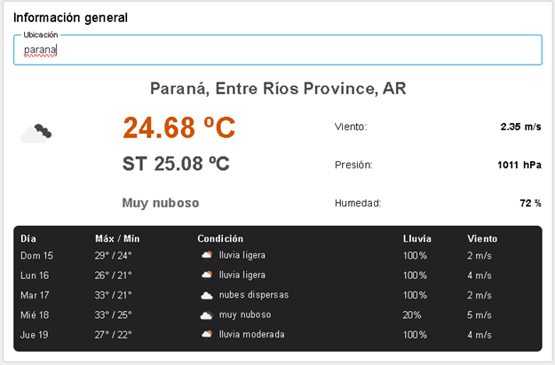
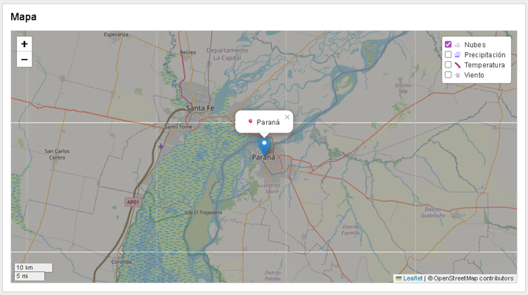
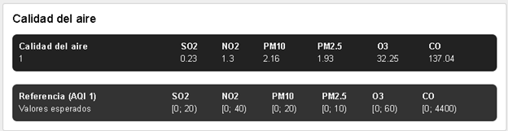

# 🌦️ NR Weather App
Aplicación sencilla construida en Node‑RED para consultar y visualizar informacion meteorologica en tiempo real utilizando una API externa de clima.

## Caracteristicas
- Obtiene datos del clima desde un servicio externo (API).
- Procesa y formatea la informacion mediante flujos de Node-RED.
- Incluye dashboard con Node-RED Dashboard 2.0.
- Estructura modular y facil de extender.
- Pensado para pruebas rapidas, demos o como base para proyectos educativos.

## Capturas y explicacion

### Informacion general
Vista principal con busqueda por ubicacion, temperatura actual y sensacion termica, descripcion del estado del cielo y un resumen diario con maximo/minimo, lluvia y viento.



### Mapa
Mapa interactivo con capas (nubes, precipitacion, temperatura y viento) centrado en la ubicacion consultada.



### Calidad del aire
Panel con valores actuales de calidad del aire y una referencia para comparar rangos esperados.



## Requisitos
- Docker Desktop (incluye Docker Compose)
- Una API key valida de OpenWeatherMap

## Como ejecutar (Docker)
1. Clona este repositorio:

```bash
git clone https://github.com/jrizzato/nr-docker-weather-app.git
```

2. Entra al directorio:

```bash
cd nr-weather-app
```

3. Levanta los contenedores (primera vez con build):

```bash
docker compose up --build
```

4. Abre Node-RED en el navegador:

- Editor: http://localhost:1880
- Dashboard: http://localhost:1880/dashboard/page1

5. Configura tu API key en los nodos correspondientes (OpenWeather). Puedes:

- Editar los nodos HTTP request / template dentro del editor de Node-RED, o
- Reemplazar el valor de `appid=` en [node-red/workspace/flows.json](node-red/workspace/flows.json).

6. Guarda los cambios para que se persistan en el volumen `./node-red/workspace`.

## ⏹Detener
```bash
docker compose down
```

## Licencia
MIT — usalo libremente para aprender, ensenar o construir tus propios proyectos.
